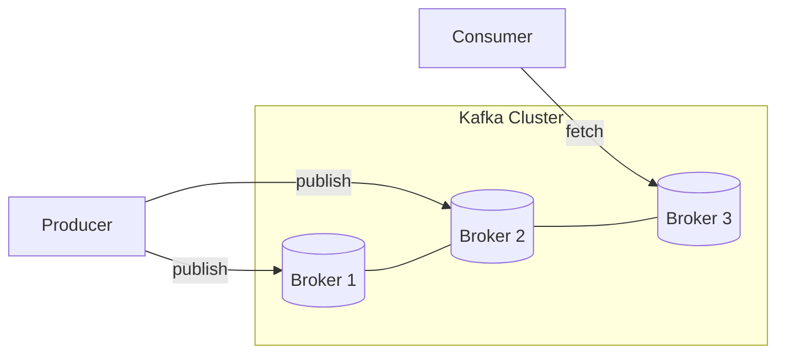
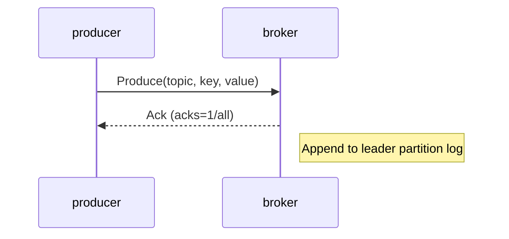
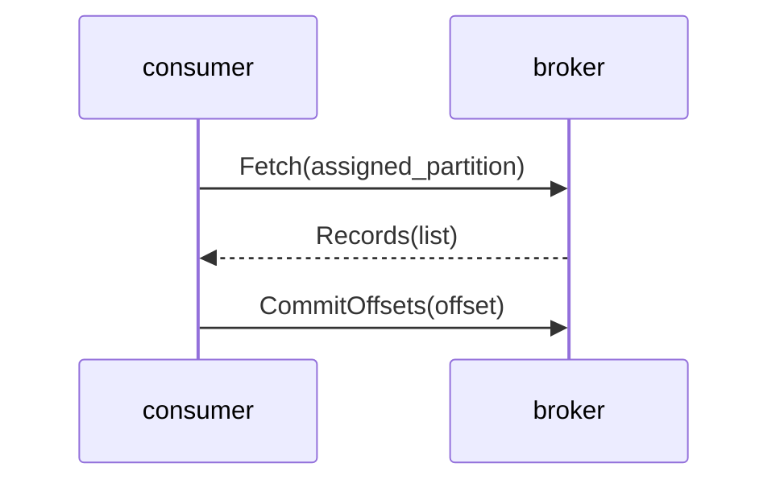
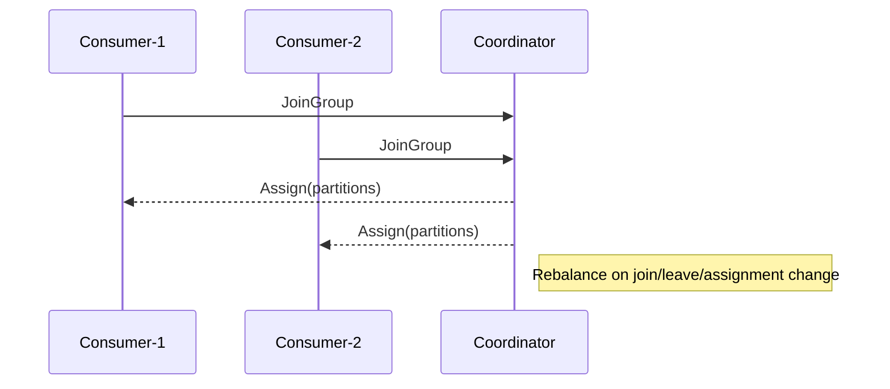
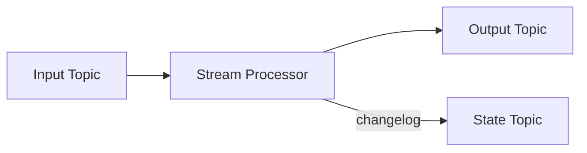

# Kafka Learning — Comprehensive Guide

This repository contains learning material about Apache Kafka: core concepts, architecture, common workflows, operational best practices, and diagrams to help you visualize how Kafka works.

## Table of Contents
- **Overview**
- **Core Concepts**
- **Architecture**
- **Common Workflows (with diagrams)**
  - Producing messages
  - Consuming messages
  - Replication & failover
  - Consumer group rebalancing
  - Stream processing
- **Operational Tips & Best Practices**
- **Quick CLI Examples**
- **Monitoring & Troubleshooting**
- **Security**
- **Further Reading**

## Overview

Apache Kafka is a distributed event streaming platform used for building real-time data pipelines and streaming applications. Kafka provides durable, ordered, and partitioned logs which make it a reliable backbone for event-driven architectures.

Key use cases:
- Event sourcing
- Real-time analytics
- Log aggregation
- Stream processing and ETL
- Messaging and decoupling microservices

## Core Concepts

- **Broker**: A Kafka server that stores topics and serves clients.
- **Topic**: A named stream of records; partitioned for scalability.
- **Partition**: An ordered, immutable sequence of records. Each partition is an append-only log and has an offset for each record.
- **Producer**: Writes records to topics.
- **Consumer**: Reads records from topics.
- **Consumer Group**: A group of consumers which together consume a topic's partitions for parallelism; each partition is consumed by only one consumer in the group.
- **Offset**: A numeric position in a partition identifying each record.
- **Replication**: Copies of partitions across brokers for fault tolerance.
- **ISR (In-Sync Replicas)**: Replicas that are up-to-date and eligible to become leader.
- **Leader/Follower**: Each partition has one leader (handles reads/writes) and zero or more followers (replicate leader).
- **Exactly-once semantics (EOS)**: Achieved via idempotent producers + transactional APIs.

## Architecture

At a high level, Kafka clusters consist of multiple brokers that host partitions for topics. Clients (producers and consumers) interact with the cluster using the broker addresses.

Mermaid cluster view:



## Common Workflows (with diagrams)

1) Producing messages

Description: Producers send messages to a topic. The topic's partitioning determines which partition receives the record (by key/hash or round-robin). Producers can enable acknowledgements (`acks`) and idempotence.



Notes:
- `acks=0,1,all` trade latency vs durability.
- `enable.idempotence=true` avoids duplicates on retries.

2) Consuming messages

Description: Consumers in a consumer group fetch records from assigned partitions and commit offsets to Kafka (or an external store). This enables fault-tolerant, parallel consumption.



3) Replication & failover

Description: Each partition's leader replicates data to followers. If the leader fails, one of the ISR becomes the new leader.

```mermaid
flowchart LR
  subgraph Partition[Partition: topic-0]
    Leader[Leader\n(Broker 1)]
    Follower1[Follower\n(Broker 2)]
    Follower2[Follower\n(Broker 3)]
  end
  Leader -->|replicate| Follower1
  Leader -->|replicate| Follower2
  %% failure
  Leader x--x Broker1
  Follower1 -->|becomes leader| Leader
```

4) Consumer group rebalancing

Description: When consumers join/leave or topic partitions change, Kafka triggers a rebalance to reassign partitions among consumers.



5) Stream processing (Kafka Streams / ksqlDB)

Description: Stream processing apps consume from input topics, process events (stateless or stateful), and produce to output topics. Stateful processors use changelog topics for fault-tolerance.



## Operational Tips & Best Practices

- Set an appropriate `replication.factor` (>=3 recommended for production).
- Tune partition count to balance parallelism and management overhead.
- Keep `log.retention` and `retention.bytes` aligned with storage capacity and compliance needs.
- Use `acks=all` and replication factor > 1 for durability-critical topics.
- Enable `min.insync.replicas` to ensure write availability requirements.
- Use idempotent producers and transactions for exactly-once workflows when needed.
- Monitor ISR size, under-replicated partitions, and consumer lag.
- Automate broker deployment and configuration via IaC (Ansible, Terraform, Helm for Kubernetes).

## Quick CLI Examples

Create a topic:

```bash
kafka-topics.sh --create --bootstrap-server localhost:9092 --replication-factor 3 --partitions 6 --topic events
```

Produce messages (console producer):

```bash
kafka-console-producer.sh --broker-list localhost:9092 --topic events
> {"user":"alice","action":"login"}
```

Consume messages (console consumer):

```bash
kafka-console-consumer.sh --bootstrap-server localhost:9092 --topic events --from-beginning
```

Describe topic:

```bash
kafka-topics.sh --describe --bootstrap-server localhost:9092 --topic events
```

Commit offsets manually (Java consumer example):

```java
consumer.commitSync(Collections.singletonMap(tp, new OffsetAndMetadata(offset)));
```

## Monitoring & Troubleshooting

- Monitor metrics: broker JVM, request rates, network IO, disk usage, topic partitions, consumer lag.
- Track key metrics: Under-replicated partitions, Offline partitions, Consumer lag, Request queue sizes, Fetch/Produce latencies.
- Tools: Prometheus + Grafana, Confluent Control Center, Burrow (consumer lag), Cruise Control (elasticity/partition rebalancing), Datadog.

Common issues:
- Consumer lag: Investigate consumer processing speed, GC pauses, network issues.
- Under-replicated partitions: Look for broker outages or slow disk I/O.
- Leader election flaps: Check broker stability and Zookeeper/KRaft health.

## Security

- Encryption: Enable TLS for client–broker and inter-broker communication.
- Authentication: Use SASL (SCRAM, GSSAPI/Kerberos, or OAuth) or mutual TLS.
- Authorization: Use ACLs to restrict topic/consumer group access.

## Further Reading

- Kafka official docs: https://kafka.apache.org
- Kafka Streams: https://kafka.apache.org/documentation/streams/
- Confluent blog & tutorials
- Papers: "Kafka: a Distributed Messaging System for Log Processing"

---

If you'd like, I can:
- add a set of sample topics and example data files under `assets/` for hands-on practice;
- include a small `docker-compose.yml` to run a local Kafka (with KRaft or Zookeeper) for tutorials;
- expand any section into a full tutorial (e.g., transactional producers, consumer rebalancing strategies).
